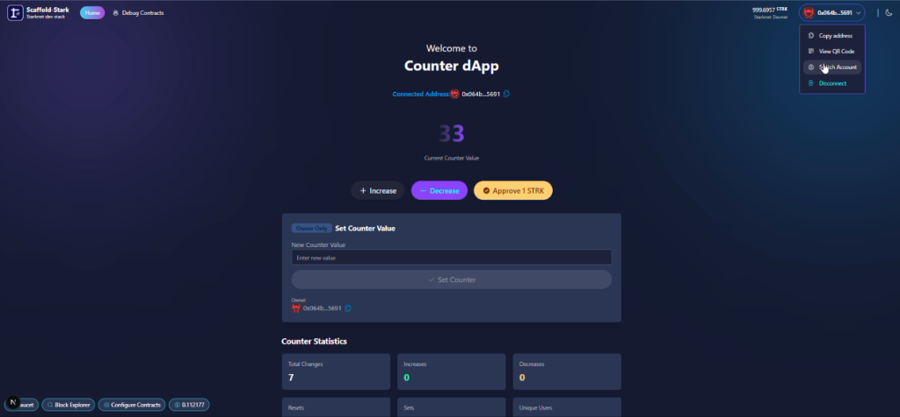

# 🔢 Counter DApp - Starknet

<h4 align="center">
  <a href="https://docs.scaffoldstark.com/">Scaffold-Stark Documentation</a> |
  <a href="https://scaffoldstark.com/">Scaffold-Stark Website</a> |
  <a href="https://www.youtube.com/playlist?list=PLMXIoXErTTYV-Pd6tXu0TzsQ2EYQ5bBEh">Developer Basecamp 13 Tutorial</a>
</h4>

## 📖 About Counter DApp

**Counter DApp** is a decentralized application built on Starknet that demonstrates smart contract interactions through a simple counter mechanism. This project serves as a practical example of building full-stack dApps using **Scaffold-Stark 2**, following the [Developer Basecamp 13 tutorial series](https://www.youtube.com/playlist?list=PLMXIoXErTTYV-Pd6tXu0TzsQ2EYQ5bBEh).

### 🎯 Features

- **Increase/Decrease Counter**: Users can increment or decrement a counter value stored on-chain
- **Reset Counter**: Reset the counter to zero (requires 1 STRK payment)
- **Set Counter (Owner Only)**: Contract owner can set the counter to any arbitrary value
- **Real-time Event Monitoring**: View counter changes in real-time with event notifications
- **Analytics Dashboard**: Track counter statistics, user leaderboard, and action distribution
- **Wallet Integration**: Connect with multiple Starknet wallet providers or use the built-in burner wallet

<div align="center">
  
</div>

### 🏗️ Built With

This project is built using **Scaffold-Stark 2**, an open-source toolkit for building dApps on Starknet:

- ⚙️ **Next.js 14** - React framework with App Router
- 🔷 **Starknet.js** - JavaScript library for Starknet
- 📦 **Scarb** - Cairo package manager
- ⚛️ **Starknet-React** - React hooks for Starknet
- 🧪 **Starknet Foundry** - Testing and deployment toolchain
- 🎨 **Tailwind CSS + daisyUI** - Styling framework

- ✅ **Contract Fast Reload**: Your frontend auto-adapts to your smart contracts as you deploy them.
- 🪝 [**Custom hooks**](https://docs.scaffoldstark.com/hooks/): Collection of React hooks wrapper around [starknet-react](https://starknet-react.com/) to simplify interactions with smart contracts with typescript autocompletion.
- 🧱 [**Components**](https://docs.scaffoldstark.com/components): Collection of common web3 components to quickly build your frontend.
- 🔥 **Burner Wallet & Prefunded Account**: Quickly test your application with a burner wallet and prefunded accounts.
- 🔐 **Integration with Wallet Providers**: Connect to different wallet providers and interact with Starknet network.


## 0. Requirements

Before you begin, you need to install the following tools:

- [Node (>= v22)](https://nodejs.org/en/download/)
- Yarn ([v1](https://classic.yarnpkg.com/en/docs/install/) or [v2+](https://yarnpkg.com/getting-started/install))
- [Git](https://git-scm.com/downloads)

## 1. Install developer tools

You can install the developer tools natively or use Dev Containers.

### Option 1: Natively install developer tools

#### 1.1 Starkup

Tool for installing all the Starknet essentials for development. [Starkup](https://github.com/software-mansion/starkup) will install the latest stable versions of:

- [Scarb](https://docs.swmansion.com/scarb/) - Cairo package manager and build toolchain
- [Starknet Foundry](https://foundry-rs.github.io/starknet-foundry/index.html) - Development toolchain for testing on Starknet
- [asdf](https://asdf-vm.com/guide/getting-started.html) - Version manager to easily switch between tool versions
- [Cairo 1.0 extension](https://marketplace.visualstudio.com/items?itemName=starkware.cairo1) for VSCode - Syntax highlighting and language support
- [Starknet Devnet](https://0xspaceshard.github.io/starknet-devnet/) - Starknet Devnet

To install `starkup`, run the following command:

```sh
curl --proto '=https' --tlsv1.2 -sSf https://sh.starkup.sh | sh
```

#### 1.2 Create your project

Open a terminal and run the following command:

```bash
npx create-stark@latest
cd my-dapp-example
yarn install
```

Now you have a new project with the basic structure.

#### 1.3 Troubleshooting

- If you run into version errors after using `starkup` or `asdf`, you can try to install the dependencies manually. Check the details below.

<details>

#### Installing with ASDF

Using ASDF, you can install the required dependencies of Scaffold Stark 2 in a single command. You can do so by doing

```bash
asdf install
```

You can refer to the guide of manual installation of asdf [here](https://asdf-vm.com/guide/getting-started.html).

#### Scarb version

To ensure the proper functioning of scaffold-stark, your `Scarb` version must match the version specified in [Compatible versions](#compatible-versions). To accomplish this, first check Scarb version:

```sh
scarb --version
```

If your `Scarb` version is not the version specified in [Compatible versions](#compatible-versions), you need to install it. If you already have installed `Scarb` via `starkup`, you can setup this specific version with the following command:

```sh
asdf install scarb <version> && asdf set scarb <version>
```

Replace `<version>` with the exact version from [Compatible versions](#compatible-versions). Otherwise, you can install Scarb following the [instructions](https://docs.swmansion.com/scarb/download.html#install-via-asdf).

#### Starknet Foundry version

To ensure the proper functioning of the tests on scaffold-stark, your `Starknet Foundry` version must match the version specified in [Compatible versions](#compatible-versions). To accomplish this, first check your `Starknet Foundry` version:

```sh
snforge --version
```

If your `Starknet Foundry` version is not the version specified in [Compatible versions](#compatible-versions), you need to install it. If you already have installed `Starknet Foundry` via `starkup`, you can setup this specific version with the following command:

```sh
asdf install starknet-foundry <version> && asdf set starknet-foundry <version>
```

Replace `<version>` with the exact version from [Compatible versions](#compatible-versions). Otherwise, you can install Starknet Foundry following the [instructions](https://foundry-rs.github.io/starknet-foundry/getting-started/installation.html#installation-via-asdf).

#### Starknet-devnet version

To ensure the proper functioning of scaffold-stark, your `starknet-devnet` version must match the version specified in [Compatible versions](#compatible-versions). To accomplish this, first check your `starknet-devnet` version:

```sh
starknet-devnet --version
```

If your `starknet-devnet` version is not the version specified in [Compatible versions](#compatible-versions), you need to install it.

- Install starknet-devnet via `asdf` ([instructions](https://github.com/gianalarcon/asdf-starknet-devnet/blob/main/README.md)). Use the exact version from [Compatible versions](#compatible-versions).

</details>

### Option 2. Dev Containers

#### 2.1 Install Docker Desktop

As an alternative to installing the tools locally (Scarb, Starknet Foundry, Starknet Devnet), you can use Docker, this is the recommended option for `Windows` users. Here's what you need to do:

1. Install [Docker Desktop](https://www.docker.com/get-started/)
2. Install [Dev Containers](https://marketplace.visualstudio.com/items?itemName=ms-vscode-remote.remote-containers)
3. Create a new project folder.

- `npx create-stark@latest`
- `cd my-dapp-example`

4. Check your project folder contains a `devcontainer.json` file. This file is used to set up the environment:

- The configuration uses the `starknetfoundation/starknet-dev:<Scarb version>` image with the Scarb version specified in [Compatible versions](#compatible-versions).
- This includes all required tools pre-installed, such as Scarb, Starknet Foundry, Starknet Devnet and other dependencies.

#### 2.2 Getting Started with Docker Setup

To start using the Docker-based setup:

1. Open the project in **Visual Studio Code**.
2. Select **"Reopen in Container"**.
3. If you need to rebuild the container, open the Command Palette (**View -> Command Palette**) and choose:
   - **Dev Containers: Rebuild and Reopen in Container**

> Once inside the container, you can start working with all the tools and dependencies pre-configured.

Now you are ready!!!

## Compatible versions

- Starknet-devnet - 0.6.1
- Scarb - v2.12.2
- Snforge - v0.51.1
- Cairo - v2.12.2
- Rpc - v0.9.x

## 🚀 Quickstart: Running Counter DApp Locally

This guide will walk you through setting up and running the Counter DApp on your local machine using Starknet Devnet.

### Prerequisites

Make sure you have completed the [installation steps](#1-install-developer-tools) above before proceeding.

### Step 1: Clone the Repository

```bash
git clone <repository-url>
cd dapp_starknet
yarn install
```

### Step 2: Start the Local Starknet Network (Terminal 1)

Open your first terminal and run:

```bash
yarn chain
```

**What you'll see:**

- The command starts Starknet Devnet on `http://127.0.0.1:5050`
- You'll see output indicating the network is running
- Devnet provides prefunded accounts that you can use for testing
- The network will keep running until you stop it (Ctrl+C)

**Example output:**

```
Starting Starknet Devnet...
Listening on http://127.0.0.1:5050
Pre-funded accounts available
```

> 💡 **Tip**: To run a fork of a specific network, use: `yarn chain --fork-network <URL> [--fork-block <BLOCK_NUMBER>]`

### Step 3: Deploy the Counter Contract (Terminal 2)

Open a second terminal (keep Terminal 1 running) and deploy the contract:

```bash
yarn deploy
```

**What you'll see:**

- The contract compiles using Scarb
- Deployment transaction is sent to Devnet
- Contract address is displayed
- The contract ABI and address are automatically saved to `packages/nextjs/contracts/deployedContracts.ts`

**Example output:**

```
Compiling contracts...
Deploying CounterContract...
Contract deployed at: 0x...
✅ Deployment successful!
```

By default, Scaffold-Stark uses the first prefunded account from `starknet-devnet` as the deployer address. This account becomes the contract owner.

### Step 4: Start the Frontend (Terminal 3)

Open a third terminal (keep Terminals 1 and 2 running) and start the Next.js application:

```bash
yarn start
```

**What you'll see:**

- Next.js development server starts
- The app compiles and builds
- Server runs on `http://localhost:3000`
- Hot reload is enabled for development

**Example output:**

```
▲ Next.js 14.x.x
- Local:        http://localhost:3000
- Ready in X seconds
```

### Step 5: Access the Application

1. Open your browser and navigate to: **http://localhost:3000**

2. **Connect a Wallet:**
   - Click the "Connect Wallet" button in the top right
   - You can use:
     - **Burner Wallet** (built-in, no setup required) - Recommended for quick testing
     - **Argent X** browser extension
     - **Braavos** browser extension
     - Other Starknet-compatible wallets

3. **Using the Burner Wallet:**
   - The burner wallet is automatically created when you select it
   - It comes prefunded with test tokens from Devnet
   - No need to import or configure anything
   - Perfect for local development and testing

4. **Interact with the Counter:**
   - **Increase**: Click the "Increase" button to increment the counter
   - **Decrease**: Click the "Decrease" button to decrement (disabled when counter is 0)
   - **Reset**: Click "Reset" to set counter to 0 (requires 1 STRK approval and payment)
   - **Set Counter**: If you're the contract owner, you can set any value directly

5. **Explore Features:**
   - View real-time counter changes in the events section
   - Check statistics and analytics
   - See the leaderboard of top contributors
   - Monitor counter evolution over time

### Environment Variables

The `yarn postinstall` script automatically creates `.env` files from `.env.example` templates. If needed, you can manually create them:

- `packages/nextjs/.env` - Frontend environment variables
- `packages/snfoundry/.env` - Smart contract deployment variables

> ⚠️ **IMPORTANT**: Never commit your private keys or sensitive environment variables to version control. The `.env` files are included in `.gitignore` by default, but always double-check before pushing your changes.

### Project Structure

This project follows the Scaffold-Stark 2 monorepo structure:

```
dapp_starknet/
├── packages/
│   ├── nextjs/                    # Frontend application
│   │   ├── app/                   # Next.js 14 App Router
│   │   │   └── page.tsx          # Main Counter DApp page
│   │   ├── components/            # React components
│   │   │   ├── CounterDisplay.tsx
│   │   │   ├── IncreaseCounter.tsx
│   │   │   ├── DecreaseCounter.tsx
│   │   │   ├── ResetCounter.tsx
│   │   │   ├── SetCounter.tsx
│   │   │   ├── CounterEvents.tsx
│   │   │   ├── CounterStats.tsx
│   │   │   ├── CounterAnalytics.tsx
│   │   │   ├── CounterLeaderboard.tsx
│   │   │   └── CounterNotifications.tsx
│   │   ├── hooks/                 # Custom React hooks
│   │   │   └── scaffold-stark/   # Scaffold-Stark hooks
│   │   ├── contracts/             # Auto-generated contract data
│   │   │   └── deployedContracts.ts
│   │   └── scaffold.config.ts     # Scaffold configuration
│   │
│   └── snfoundry/                 # Smart contracts
│       ├── contracts/
│       │   └── src/
│       │       └── counter.cairo  # Counter smart contract
│       ├── scripts-ts/
│       │   └── deploy.ts          # Deployment script
│       └── tests/                 # Contract tests
│
└── README.md
```

### How It Works

1. **Smart Contract** (`counter.cairo`):
   - Stores a counter value on-chain
   - Implements `Ownable` pattern for access control
   - Emits `CounterChanged` events for all state changes
   - Requires STRK payment for reset functionality

2. **Frontend Components**:
   - Use Scaffold-Stark hooks (`useScaffoldReadContract`, `useScaffoldWriteContract`) to interact with the contract
   - Real-time updates via event watching
   - Responsive UI built with Tailwind CSS and daisyUI

3. **Event System**:
   - All counter changes emit events with reason (Increase/Decrease/Reset/Set)
   - Frontend subscribes to events for real-time updates
   - Historical event data powers analytics and leaderboard

### Learning Resources

This project is based on the **Developer Basecamp 13** tutorial series:

📺 **[Watch the Tutorial Series](https://www.youtube.com/playlist?list=PLMXIoXErTTYV-Pd6tXu0TzsQ2EYQ5bBEh)**

The series consists of 6 videos covering:

- Setting up Scaffold-Stark 2
- Writing Cairo smart contracts
- Building React frontends
- Integrating wallets
- Deploying to testnets
- And more!

## Quickstart 2: Deploying a Smart Contract to Sepolia Testnet

<details>

1. Make sure you already cloned this repo and installed dependencies.

2. Prepare your environment variables.

Find the `packages/snfoundry/.env` file and fill the env variables related to Sepolia testnet with your own wallet account contract address and private key. Find the `packages/nextjs/.env` file and fill the env variable related to Sepolia testnet rpc url.

3. Change your default network to Sepolia testnet.

Find the `packages/nextjs/scaffold.config.ts` file and change the `targetNetworks` to `[chains.sepolia]`.


4. Get some testnet tokens.

You will need to get some `STRK` Sepolia tokens to deploy your contract to Sepolia testnet.

> Some popular faucets are [Starknet Faucet](https://starknet-faucet.vercel.app/) and [Blastapi Starknet Sepolia STRK](https://blastapi.io/faucets/starknet-sepolia-strk)

4. Open a terminal, deploy the sample contract to Sepolia testnet:

```bash
yarn deploy --network sepolia
```

5. On a second terminal, start your NextJS app:

```bash
yarn start
```

Visit your app on: `http://localhost:3000`. You can interact with your smart contract using the `Debug Contracts` page.

</details>

## Setup RPC specific version

<details>

To ensure the proper functioning of the scaffold-stark with Testnet or Mainnet, your RPC version must match the version specified in [Compatible versions](#compatible-versions). This repository contains `.env.example` files with the default RPC URLs. Check the RPC URLs in `packages/nextjs/.env.example` and `packages/snfoundry/.env.example` for the current endpoints. Let's verify this RPC version by calling a `POST` request in an API platform like `Postman` or `Insommia`. Use the RPC URL from the `.env.example` files and the body should be:

```json
{
  "jsonrpc": "2.0",
  "method": "starknet_specVersion",
  "id": 1
}
```

You have to paste the endpoint and body in the API platform and click on the `Send` button. If the response matches the RPC version in [Compatible versions](#compatible-versions), then you are good to go. Otherwise, you have to get the correct RPC URL endpoint from the `.env.example` files.


</details>

## Network Configuration Centralization

<details>

By default, majority of the Network settings are centralized in `scaffold.config.ts`, the exception being the RPC urls which are configured from your environment variables. In the absence of the proper settings, the framework will choose a random provider for you.
In the env file also, the lines configuring the networks (devnet, sepolia or mainnet) need to be uncommented, depending on what
network you want activated for you.

**How to Change Networks:**

- Update the `targetNetworks` array in `scaffold.config.ts` (first network is the primary target)

### Required Environment Variables

Set these in your `.env` file:

- `NEXT_PUBLIC_DEVNET_PROVIDER_URL`
- `NEXT_PUBLIC_SEPOLIA_PROVIDER_URL`
- `NEXT_PUBLIC_MAINNET_PROVIDER_URL`

Configuration uses these variables with fallbacks:

```typescript
"devnet": process.env.NEXT_PUBLIC_DEVNET_PROVIDER_URL || "defaultRpcValue",
"sepolia": process.env.NEXT_PUBLIC_SEPOLIA_PROVIDER_URL || "defaultRpcValue",
"mainnet": process.env.NEXT_PUBLIC_MAINNET_PROVIDER_URL || "defaultRpcValue"
```

</details>

## CLI Usage

<details>
Depending on your package manager, substitute the word `COMMAND` with the appropiate one from the list.

```bash
yarn COMMAND
npm run COMMAND
```

This repo prefer yarn as package manager.

Commands:

| Command          | Description                                                                               |
| ---------------- | ----------------------------------------------------------------------------------------- |
| format:check     | (Read only) Batch checks for format inconsistencies for the nextjs and snfoundry codebase |
| next:check-types | Compile typscript project                                                                 |
| next:lint        | Runs next lint                                                                            |
| prepare          | Install husky's git hooks                                                                 |
| usage            | Show this text                                                                            |

### CLI Smart Contracts

| Command         | Description                                                                         |
| --------------- | ----------------------------------------------------------------------------------- |
| compile         | Compiles contracts.                                                                 |
| test            | Runs snfoundry tests                                                                |
| chain           | Starts the local blockchain network.                                                |
| deploy          | Deploys contract to the configured network discarding previous deployments.         |
| deploy:no-reset | Deploys contract to the configured network without discarding previous deployments. |
| verify          | Verify Smart Contracts with Walnut                                                  |

### CLI Frontend

| Command     | Description                                  |
| ----------- | -------------------------------------------- |
| start       | Starts the frontend server                   |
| test:nextjs | Runs the nextjs tests                        |
| vercel      | Deploys app to vercel                        |
| vercel:yolo | Force deploy app to vercel (ignoring errors) |

## 🧪 Testing

### Smart Contract Tests

Run the Counter contract tests:

```bash
yarn test
```

Tests are located in `packages/snfoundry/contracts/tests/test_counter.cairo`

### Frontend Tests

Run Next.js application tests:

```bash
# Watch mode
yarn test:nextjs

# Single run
yarn test:nextjs run

# With coverage
yarn test:nextjs run --coverage
```

## 📚 What's Next

Now that you have Counter DApp running, you can:

- **Modify the Smart Contract**: Edit `packages/snfoundry/contracts/src/counter.cairo` to add new features
- **Customize the Frontend**: Update components in `packages/nextjs/components/` to change the UI
- **Add New Features**: Implement additional counter operations or analytics
- **Deploy to Testnet**: Follow the [Sepolia deployment guide](#quickstart-2-deploying-a-smart-contract-to-sepolia-testnet) to deploy to Starknet Sepolia
- **Learn More**: Check out the [Scaffold-Stark documentation](https://docs.scaffoldstark.com/) for advanced features

## 🎓 Tutorial Reference

This project follows the **Developer Basecamp 13** tutorial series. For step-by-step guidance on building this dApp, watch the complete series:

🔗 **[Developer Basecamp 13 - 6 Video Tutorial Series](https://www.youtube.com/playlist?list=PLMXIoXErTTYV-Pd6tXu0TzsQ2EYQ5bBEh)**

</details>

## Documentation

Visit our [docs](https://docs.scaffoldstark.com/) to learn how to start building with Scaffold-Stark.

To know more about its features, check out our [website](https://scaffoldstark.com)

## Contributing to Scaffold-Stark

We welcome contributions to Scaffold-Stark!

Please see [CONTRIBUTING.MD](https://github.com/Scaffold-Stark/scaffold-stark-2/blob/main/CONTRIBUTING.md) for more information and guidelines for contributing to Scaffold-Stark.
